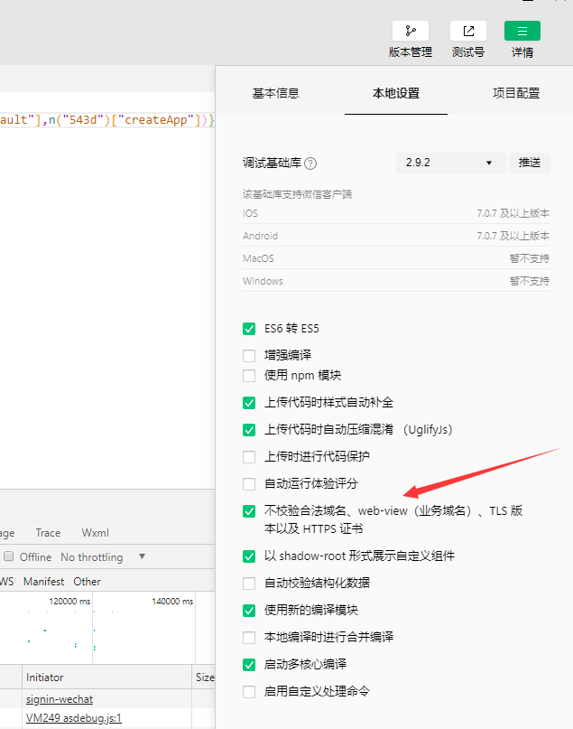

# 说明

该文件夹下放置了使用`MiCake`特性的实验性程序，它将随每次`MiCake`的更新进行调整。

## ❄️ 环境条件

**后端：**

+ `.NET Core SDK 3.0 +`
+ 带有`ASP.NET`和Web开发的 `Visual Studio 2019` 或者`Visual Studio Code`

**前端：**

+ `Node.js`

前端使用了`uni-app`来进行开发，原因是为了使用`Typescript`来进行微信小程序编译。所以对于平时使用`C#`的您来说，就算您没有做过前端开发，但是也不会对于代码感到陌生。（因为能写成`类似C#`风格的代码我都全部改写过一次）。

## 🌼 使用

### 🍀 后端

本项目使用`Sqlite`作为数据库，因此您无需下载额外的数据库程序。若您需要查看本地`Sqlite`文件中的数据，推荐您下载[`sqlitebrowser`](https://github.com/sqlitebrowser/sqlitebrowser)。

1. 还原数据库

在`Visual Studio`中选择“工具”>“NuGet 包管理器”>“包管理器控制台”，运行：

```powershell
dotnet ef database update
```

完成时，您将看到项目文件夹下生成了一个名为`micake.db`的文件。

2. 运行

在`Visual Studio`调试运行。

### 🌱 前端

前端对应了`front`文件夹下面的内容，我建议您使用`Visual Code`来打开该文件夹。然后安装对应的扩展，比如对`Vue`文件的支持插件`Vetur`。

使用`VsCode`打开`front`文件夹:

1. 还原NPM包

```powershell
npm install
```

2. 调试环境生成(H5 版本)

```powershell
npm run dev:h5
```

生成完成后您可以打开浏览器地址，则可以看到对应的前端页面。

#### 微信小程序

如果您想尝试该演示项目中部分微信小程序的功能，那么您可以生成对应的微信小程序文件。

当然前提是您需要先下载`微信开发者工具`，在微信小程序开发官网您可以下载。

然后在项目下执行生成微信小程序的命令，该命令是`uni-app`的指令，您可以在 `uni-app` [官网](https://uniapp.dcloud.io/)进行查阅。理论上您还可以生成其它各个客户端，比如支付宝小程序，安卓app等。

1. 生成微信小程序包

```powershell
 npm run build:mp-weixin
```

此时在该路径下会有一个`dist`文件夹，里面会有对应的项目。您可以打开`微信开发者工具`，然后选择该文件夹打开。

**注意：**
对于微信小程序来说，因为是演示版本，所以您需要注册您的测试`AppID`，在打开开发者工具时您将看到该选项。

如果您想使用服务端`微信小程序登录功能`，那么请把该`AppID`配置到`后端项目的appsettings.json`文件中。

## 🍂 可能遇到的一些问题

+ **前后端都打开了，为什么前端却提示访问错误**

在您运行调试的时候，一定要保证客户端所请求的`Api`地址是和后端所匹配的。该配置可以在前端的'scr/common/environment.ts'文件下配置。

+ **API地址配置正确，但是微信小程序却访问不了**

微信小程序默认是不允许任何外界的API地址的，您需要在微信小程序后台进行添加白名单。配置完成之后的地址您可以在`微信开发者工具`右上角的`详情-项目配置`看到。一般来说，您是没有办法配置`localhost`的，所以请将前端的访问地址配置为`127.0.0.1`。但是`uni-app`生成`H5`版本的时候，又不支持`127.0.0.1`，所以您可能需要来回配置😂。

+ **微信小程序访问API的时候，提示证书问题**
  
因为我们只是在测试环境中使用，所以是没有配置Https的证书，所以我们可以关闭微信小程序的验证。

  